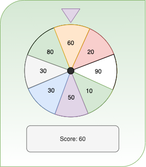

# Wheel of Fortune Version 1.0

Please take a look to the following picture and by using wheel.png file from img directory, try to create this game.
This game works as following:

- When somebody click on the wheel it should start rotating and stop in one random section.
- User can try it three times and after third try program should calculate the final score and display it in score area.
- When wheel stops in area with highest score, the program should display a greeting message as an alert.

**Note:** Please clone this repository into your computer and create html,css,js files to start working. after finishing with each part of your work please commit the result to github.

# Wheel of Fortune Version 1.1

Now it's time to upgrade the game and let the user to specify values for the wheel.  
In addition customer asks for multiplayer game. It means, at the begining moderator should specify the users then user's score should keep in the memory until end of the game to compare with other users scores and announce the winner.
